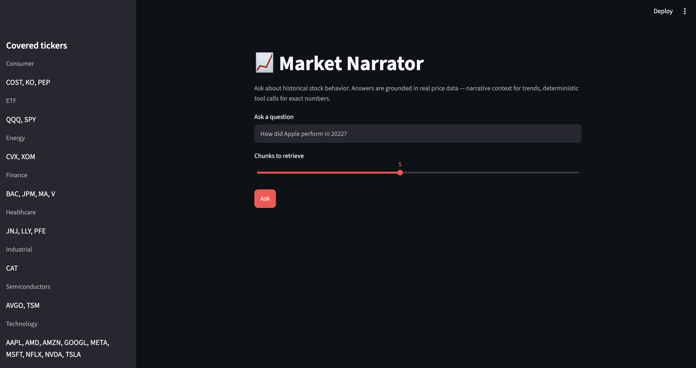
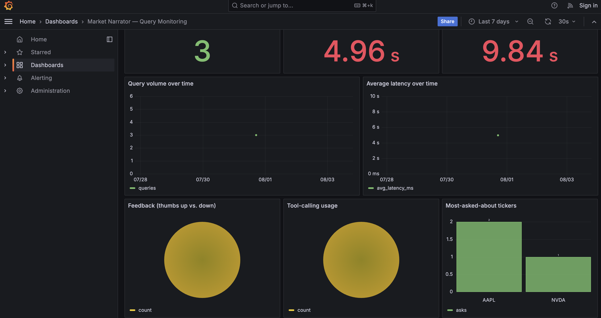
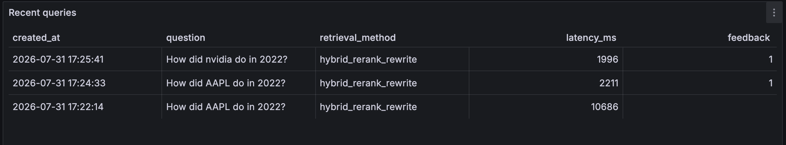

# Market Narrator

An agentic RAG application for exploring historical stock market behavior. Ask questions like *"How did Apple perform in 2022?"* or *"Compare Microsoft and Nvidia over the last five years"* and get answers grounded in real historical price data, not the LLM's memory.

## What this is

Raw daily price data isn't itself a knowledge base — it's a table of numbers. This project turns [`yfinance`](https://github.com/ranaroussi/yfinance) historical price data into a retrievable knowledge base two ways:

1. **Narrative documents.** Deterministically generated (not LLM-written) weekly/monthly/yearly summaries of price behavior per ticker — returns, volatility, drawdowns, volume trends — indexed for hybrid (vector + keyword) search.
2. **Deterministic tools.** For questions that need an exact number (a specific return, a volatility figure, a head-to-head comparison), the LLM calls a Python function that computes it directly from the price data, instead of doing arithmetic over retrieved text.

A query-rewriting step extracts structured parameters (ticker, date range) from natural-language questions, feeding both retrieval and the tools. See [`docs/PROJECT_PLAN.md`](docs/PROJECT_PLAN.md) for the full architecture and the reasoning behind these choices.

## Screenshots

**Streamlit UI** — ask a question, tune how many chunks get retrieved:



**Grafana monitoring dashboard** — query volume, latency, feedback, tool-calling usage, and most-asked-about tickers:



Recent queries, with the retrieval method and latency logged per request:



## Ticker universe

A fixed set of 26 liquid tickers across 8 sectors — see [`docs/ticker_universe.md`](docs/ticker_universe.md) for the full list and the reasoning for keeping it bounded.

## Project layout

```
src/finrag/
├── config/            Ticker universe + typed settings (single source of truth)
├── ingestion/         yfinance fetch, stats computation, narrative doc generation
├── knowledge_base/    Postgres/pgvector schema, embedding + keyword indexing
├── retrieval/         Hybrid search, reranking, query rewriting
├── agent/             Deterministic tools + the function-calling loop
├── rag/               Prompt assembly, end-to-end pipeline
├── llm/               Provider-agnostic LLM client (Groq today, OpenAI later)
├── eval/              Retrieval eval, LLM-as-judge, failure-case harness (library code)
├── monitoring/        Query/feedback logging (writes to the query_logs table)
└── api/               FastAPI service (models, routes, app)
ui/                    Streamlit frontend (calls the API over HTTP, nothing else)
eval/                  Evaluation CLI scripts, ground truth, and results
monitoring/grafana/    Grafana datasource + dashboard provisioning
tests/                 Unit + integration tests
Dockerfile.api         API container image
Dockerfile.ui          UI container image
docker-compose.yml     Full local stack: db, pgadmin, api, ui, grafana
Makefile               Shortcuts for all of the above (`make help`)
```

## Setup

Requires [`uv`](https://docs.astral.sh/uv/) and Python 3.12.

```bash
uv sync --group dev
cp .env.example .env   # fill in GROQ_API_KEY
docker compose up -d --build   # starts Postgres+pgvector, pgadmin, the API, the UI, and Grafana
```

Fetch and cache price history, then build and load the knowledge base:

```bash
uv run python -m finrag.ingestion.fetch_prices
uv run finrag-ingest
```

Now the app is live: UI at http://localhost:8501, API docs at http://localhost:8000/docs, Grafana at http://localhost:3000 (anonymous viewer access enabled locally).

Equivalently, with `make` (`make help` lists every target):

```bash
make up
make ingest
```

Ask a question from the command line instead, without the API/UI:

```bash
uv run finrag-ask "How did Apple perform in 2022?"
```

### Running the API/UI without Docker

Useful while iterating, since code changes don't need a rebuild:

```bash
uv run uvicorn finrag.api.main:app --reload      # http://localhost:8000
uv run streamlit run ui/app.py                    # http://localhost:8501, in another terminal
```

### Evaluation

```bash
uv run python eval/generate_ground_truth.py   # one-time, LLM-generated ground truth (cached)
uv run python eval/evaluate_retrieval.py      # Hit Rate / MRR across 5 retrieval configurations
uv run python eval/evaluate_llm.py            # LLM-as-judge: with-tools vs. without-tools (resumable)
uv run python eval/run_failure_cases.py       # known-tricky-question regression transcript (resumable)
```


### Tests and linting

```bash
uv run pytest                          # make test
uv run ruff check src tests eval ui    # make lint
```

## Evaluation criteria

Built for the [DataTalks.Club LLM Zoomcamp](https://github.com/DataTalksClub/llm-zoomcamp) capstone rubric ([`project.md`](https://github.com/DataTalksClub/llm-zoomcamp/blob/main/project.md)). 

| Criterion | Where |
|---|---|
| Problem description | This README, `docs/PROJECT_PLAN.md` §1 |
| Retrieval flow (knowledge base + LLM) | `docs/architecture.md` — pgvector + full-text search, fused, reranked, fed to an LLM |
| Retrieval evaluation | `eval/evaluate_retrieval.py` — 5 configurations compared (Hit Rate / MRR), results in `eval/results/` |
| LLM evaluation | `eval/evaluate_llm.py` — with-tools vs. without-tools compared via LLM-as-judge |
| Interface | FastAPI (`src/finrag/api/`) + Streamlit (`ui/app.py`) |
| Ingestion pipeline | `uv run finrag-ingest` — fully automated, one command |
| Monitoring | Feedback capture (`POST /feedback`) + a 9-panel Grafana dashboard (`monitoring/grafana/`) |
| Containerization | `docker-compose.yml` — the entire stack (db, api, ui, grafana) |
| Reproducibility | `uv.lock`, pinned Python version, `.env.example`, fixed ticker universe/date range |
| Best practices | Hybrid search, reranking, and query rewriting — all three implemented and evaluated (`retrieval/`) |
| Bonus | Agentic tool-calling, resumable evaluation scripts, CI with a real Postgres service container — see `docs/submission_checklist.md` |

## Documentation

- [`docs/architecture.md`](docs/architecture.md) — the as-built system: request flow, data flow, deployment topology
- [`docs/ticker_universe.md`](docs/ticker_universe.md) — the fixed ticker universe
- [`docs/deployment.md`](docs/deployment.md) — running the full docker-compose stack, environment variables, cloud deployment notes

