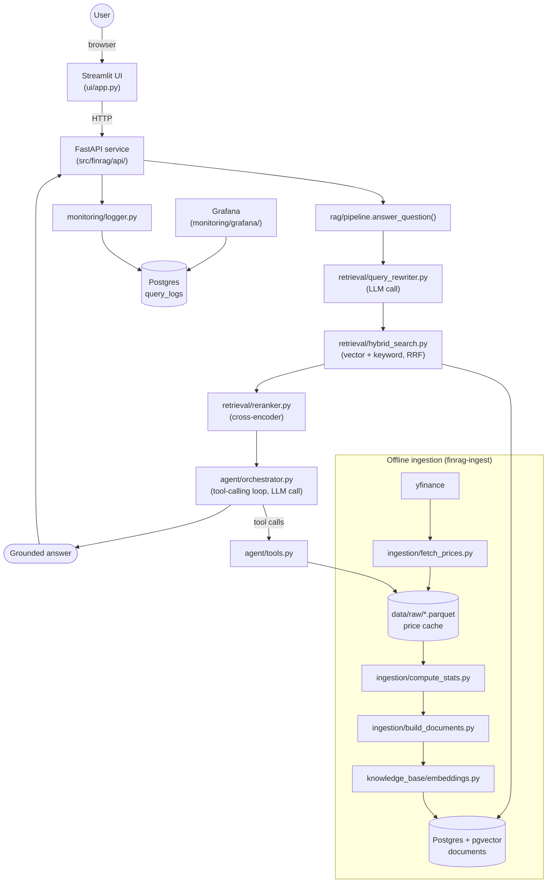
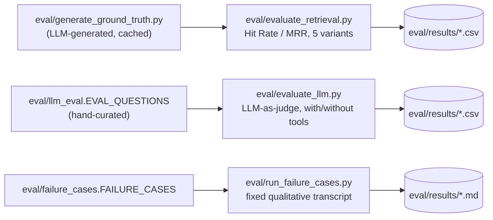

# Architecture

The as-built system, end to end; this document is the current, accurate picture of how the pieces actually fit together.

## System overview

Two databases-worth of state, one Postgres instance: `documents` (the vector-searchable knowledge base, written once by ingestion, read by every query) and `query_logs` (written once per `/ask` call, read by Grafana). `data/raw/*.parquet` is a third, file-based store the agent's tools read directly — see "A dependency the diagram above almost hides" below.

## Request flow: one `/ask` call

1. **Query rewriting** (`retrieval/query_rewriter.py`, one LLM call). Resolves company names to the fixed 26-ticker universe and cleans up the search query. Falls back to the raw question with no ticker filter if the LLM's response doesn't parse — degraded retrieval quality, never a crash.
2. **Hybrid retrieval** (`retrieval/hybrid_search.py`). Vector search (pgvector, cosine similarity via an HNSW index) and keyword search (Postgres full-text search) run independently over `documents`, filtered by the resolved ticker(s) if any, then fused by Reciprocal Rank Fusion.
3. **Reranking** (`retrieval/reranker.py`). A cross-encoder re-scores the fused candidate pool directly against the query — a more accurate but more expensive signal than either retrieval method alone, only affordable because it only runs over ~20 candidates, not the whole knowledge base.
4. **Agentic generation** (`agent/orchestrator.py`, at least one more LLM call). The model sees the reranked context and decides whether to answer directly or call a deterministic tool (`agent/tools.py`) for an exact figure — a specific return, a price on a date, a volatility number, a head-to-head comparison — computed directly from cached price data rather than estimated from retrieved text.
5. **Logging** (`monitoring/logger.py`, API layer only — not inside step 1-4's pipeline). The question, rewritten query, resolved tickers, retrieved doc ids, tool calls, latency, and answer are written to `query_logs`. A logging failure never turns a successful answer into an error response.

## A dependency the diagram above almost hides

`agent/tools.py` reads `data/raw/*.parquet` **directly from disk**, not through Postgres. This is easy to miss because everything else in the request flow goes through the `documents` table, but it matters concretely for deployment: the `api` container needs `./data` mounted (`docker-compose.yml`), or every tool call fails with `FileNotFoundError` even though retrieval works perfectly. See `docs/deployment.md` for the full explanation and `Dockerfile.api`'s comments for where this is enforced.

## Why two separate data paths for "numbers" (documents vs. tools)

`ingestion/build_documents.py` generates narrative documents for **fixed** periods — calendar weeks, months, years — computed once at ingestion time. A question asking about an arbitrary range ("AAPL's return from March 3 to June 17, 2022") will never align with one of those boundaries, so retrieval alone can only ever serve a nearby approximation. `agent/tools.py` solves this by reading the same underlying daily price data the narratives were generated from, but computing the answer live for whatever range the user actually asked about. `return_pct` and `annualized_volatility_pct` (`ingestion/compute_stats.py`) are shared between both paths specifically so a narrative document and a tool call can never disagree about what "AAPL's volatility this month" means — one formula, one place it could be wrong.

## Evaluation, as a separate concern from serving

`src/finrag/eval/` holds the pure, testable logic (metrics, ground-truth generation, judging, the retrieval-variant dispatch); the top-level `eval/*.py` scripts are thin CLI wrappers handling I/O, caching, and resumability across a Groq rate limit. None of this runs as part of serving a real `/ask` request; it's a separate, deliberately reproducible measurement layer over the same pipeline.

## Deployment topology (docker-compose)

| Service | Talks to | Why |
|---|---|---|
| `db` (Postgres+pgvector) | — | `documents` + `query_logs`, single database for both |
| `api` | `db`, Groq, `./data` (mounted) | Serves `/ask`, `/feedback`, `/tickers`, `/health` |
| `ui` | `api` only, over HTTP | No DB or LLM credentials in this process at all |
| `grafana` | `db` (read-only queries) | Dashboards over `query_logs` |
| `pgadmin` | `db` | Manual DB inspection during development |

Full detail, including the two non-obvious volume requirements (price cache, fastembed model cache) and environment variable overrides between host and compose networking: `docs/deployment.md`.
